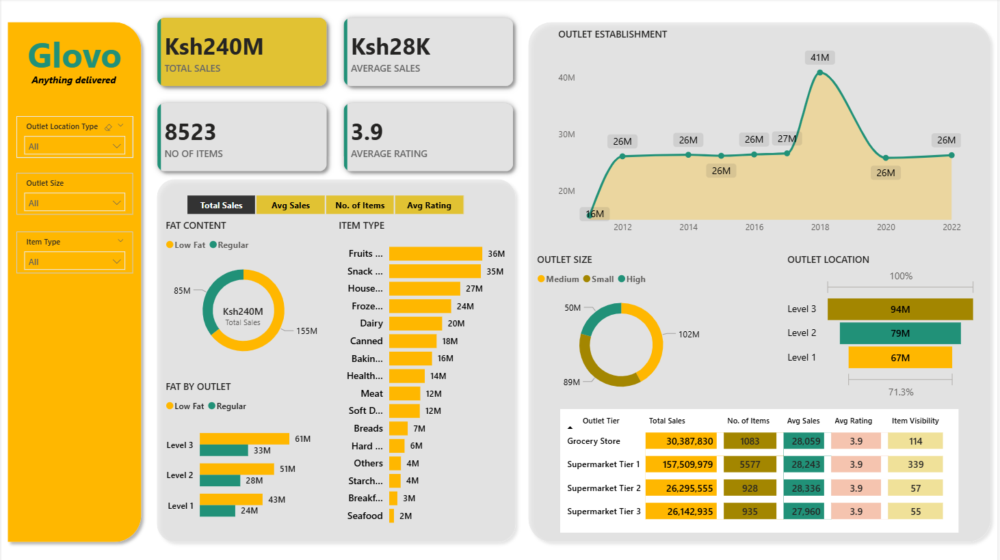

# 🛵 Glovo Sales Intelligence Dashboard
### *Power BI · Retail Analytics · Business Intelligence*


---

## 📸 Dashboard Preview



> *An interactive Power BI dashboard analysing Glovo's retail outlet performance across sales, product categories, outlet tiers, and geographic locations — built to surface actionable insights for business strategy.*

---

## 📋 Table of Contents

- [Project Overview](#-project-overview)
- [Key Metrics & Findings](#-key-metrics--findings)
- [Dashboard Features](#-dashboard-features)
- [Data Model](#-data-model)
- [Tools & Technologies](#-tools--technologies)
- [How to Use](#-how-to-use)
- [Insights & Recommendations](#-insights--recommendations)
- [Project Structure](#-project-structure)
- [Author](#-author)

---

## 🎯 Project Overview

This Power BI dashboard was built to analyse **Glovo's retail outlet and product performance** across multiple dimensions — outlet type, outlet size, product category, fat content, and geographic location tier. The goal was to transform raw transactional data into a clear, interactive visual story that a business stakeholder could use to make informed decisions.

### Business Questions Answered

| # | Question |
|---|----------|
| 1 | Which product categories generate the most sales revenue? |
| 2 | How does outlet size (Small, Medium, High) affect total sales? |
| 3 | What is the sales distribution between Low Fat and Regular fat content items? |
| 4 | How does outlet establishment year correlate with sales performance over time? |
| 5 | Which outlet location tier (Level 1, 2, 3) is most profitable? |
| 6 | What is the relationship between item visibility and average sales? |

---

## 📊 Key Metrics & Findings

| Metric | Value |
|--------|-------|
| 💰 **Total Sales** | **Ksh 240M** |
| 📦 **Number of Items** | **8,523** |
| 📈 **Average Sales per Item** | **Ksh 28K** |
| ⭐ **Average Customer Rating** | **3.9 / 5.0** |

### 🔑 Top Findings at a Glance

- **Fruits & Vegetables** and **Snack Foods** are the top-grossing categories — Ksh 36M and Ksh 35M respectively
- **Regular fat content** products (Ksh 155M) significantly outsell **Low Fat** items (Ksh 85M) — a 1.8× difference
- **Supermarket Tier 1** outlets dominate with **Ksh 157.5M** in sales — over 65% of total revenue
- Sales peaked in **2018 at Ksh 41M**, then stabilised around **Ksh 26M** from 2020 onwards
- **Level 3 locations** generate the highest outlet location revenue at **Ksh 94M**
- **Medium-sized outlets** (Ksh 102M) outperform both Small and High categories

---

## ✨ Dashboard Features

### 📌 Interactive Filters (Slicers)
The dashboard includes three dynamic slicers that allow users to slice and explore the data in real time:

| Slicer | Options |
|--------|---------|
| **Outlet Location Type** | All / Level 1 / Level 2 / Level 3 |
| **Outlet Size** | All / Small / Medium / High |
| **Item Type** | All / Fruits & Vegetables / Snacks / Dairy / etc. |

> All visuals respond simultaneously when a filter is applied — no manual refresh needed.

---

### 📈 Visuals Breakdown

#### 1. KPI Cards (Top Row)
Four headline metrics displayed prominently at the top:
- **Total Sales** — overall revenue across all outlets and products
- **Average Sales** — average revenue per item sold
- **No. of Items** — total distinct items tracked
- **Average Rating** — mean customer satisfaction score

#### 2. Fat Content Donut Chart
Shows the split of **Total Sales between Low Fat and Regular** products. Allows the viewer to quickly assess whether health-conscious product lines are gaining market share.

#### 3. Fat by Outlet Bar Chart
Breaks down the Low Fat vs. Regular sales split **per outlet location level** (Level 1, 2, 3), showing whether buying preferences differ by geography.

#### 4. Item Type Horizontal Bar Chart
Ranks all **16 product categories** by total sales — from Fruits & Vegetables (Ksh 36M) down to Seafood (Ksh 2M). This is the primary category performance view.

#### 5. Outlet Establishment Line Chart
Tracks **total sales by year of outlet establishment** from 2012 to 2022. Reveals how the age and vintage of an outlet correlates with its sales volume over time — a key strategic insight for expansion planning.

#### 6. Outlet Size Donut Chart
Shows the sales contribution of **Small, Medium, and High** sized outlets — Medium at Ksh 102M leads, suggesting mid-scale outlets are the sweet spot.

#### 7. Outlet Location Stacked Bar Chart
Compares revenue and percentage contribution across **Level 1, Level 2, and Level 3** outlet locations — useful for geographic investment decisions.

#### 8. Outlet Tier Summary Table
A detailed matrix showing **per-outlet-tier metrics**:
- Total Sales
- Number of Items
- Average Sales
- Average Rating
- Item Visibility

---

## 🗃️ Data Model

The dataset covers retail outlet and product data structured around the following key fields:

```
📁 Dataset Fields
├── 🏪 Outlet Fields
│   ├── Outlet_Identifier        — Unique outlet ID
│   ├── Outlet_Establishment_Year — Year the outlet was established
│   ├── Outlet_Size              — Small / Medium / High
│   ├── Outlet_Location_Type     — Level 1 / Level 2 / Level 3
│   └── Outlet_Type              — Grocery Store / Supermarket Tier 1–3
│
├── 🛒 Product Fields
│   ├── Item_Identifier          — Unique product ID
│   ├── Item_Type                — Category (Fruits, Dairy, Snacks, etc.)
│   ├── Item_Fat_Content         — Low Fat / Regular
│   ├── Item_Visibility          — % of display shelf space
│   └── Item_MRP                 — Maximum Retail Price
│
└── 💰 Performance Fields
    ├── Item_Outlet_Sales         — Total sales (target variable)
    └── Rating                   — Customer satisfaction score (1–5)
```

---

## 🛠️ Tools & Technologies

| Tool | Purpose |
|------|---------|
| **Microsoft Power BI Desktop** | Dashboard creation, data modelling, DAX measures |
| **Power Query** | Data cleaning, transformation, and shaping |
| **DAX (Data Analysis Expressions)** | Custom KPI measures and calculated columns |
| **Excel / CSV** | Source data format |

### DAX Measures Used

```dax
-- Total Sales
Total Sales = SUM(Sales[Item_Outlet_Sales])

-- Average Sales per Item
Avg Sales = AVERAGE(Sales[Item_Outlet_Sales])

-- Average Rating
Avg Rating = AVERAGE(Sales[Rating])

-- Number of Items
No. of Items = COUNTROWS(Sales)

-- Item Visibility (Average)
Avg Visibility = AVERAGE(Sales[Item_Visibility])
```

---

## 🚀 How to Use

### Prerequisites
- [Power BI Desktop](https://powerbi.microsoft.com/desktop/) (free) — version 2.0 or later

### Steps to Run

```bash
# 1. Clone this repository
git clone https://github.com/yourusername/glovo-powerbi-dashboard.git

# 2. Navigate to the project folder
cd glovo-powerbi-dashboard

# 3. Open the Power BI file
# Double-click: Glovo_Dashboard.pbix
# OR open Power BI Desktop → File → Open → select Glovo_Dashboard.pbix
```

### Using the Dashboard

1. **Apply Filters** — Use the three slicers on the left panel to filter by Outlet Location Type, Outlet Size, or Item Type
2. **Cross-filter** — Click any bar, slice, or data point in a visual to automatically filter all other charts
3. **Hover for Tooltips** — Hover over any data point to see the exact values
4. **Toggle Metrics** — Use the tab buttons (Total Sales / Avg Sales / No. of Items / Avg Rating) to switch the Item Type chart view
5. **Reset Filters** — Click the eraser icon on any slicer or use `Ctrl + Z` to undo

---

## 💡 Insights & Recommendations

Based on the dashboard analysis, here are the key strategic takeaways:

### 1. 🏪 Double Down on Supermarket Tier 1
Supermarket Tier 1 outlets generate **Ksh 157.5M** — more than the other three outlet types combined. Investment in maintaining and expanding Tier 1 locations should be the top priority.

### 2. 🥦 Prioritise Fruits, Snacks & Household Products
The top three categories (Fruits & Vegetables, Snack Foods, Household) account for **Ksh 98M** — over 40% of total sales. Ensuring consistent stock and shelf visibility in these categories will protect the bulk of revenue.

### 3. 📉 Investigate the 2018–2020 Sales Drop
Sales peaked at Ksh 41M in 2018 and fell sharply to Ksh 26M by 2020. Understanding what drove this decline — whether economic factors, increased competition, or outlet closures — is critical before planning new outlet openings.

### 4. 🥑 Re-evaluate the Low Fat Strategy
Regular products outsell Low Fat by 1.8× (Ksh 155M vs Ksh 85M). Either the Low Fat range needs stronger marketing, or shelf space allocation should be rebalanced toward Regular products to maximise revenue.

### 5. 📍 Expand in Level 3 Locations
Level 3 locations generate Ksh 94M — the highest of any location tier. There is a strong case for prioritising Level 3 geographic expansion over Level 1 (Ksh 67M).

### 6. 📦 Medium Outlets are the Sweet Spot
Medium-sized outlets generate the highest sales (Ksh 102M) vs Small (Ksh 89M) and High (Ksh 50M). New outlet builds should target the Medium size format for the best return on capital.

---

## 📁 Project Structure

```
glovo-powerbi-dashboard/
│
├── 📊 Glovo_Dashboard.pbix       # Main Power BI file
├── 📸 Glovo_Capture.png          # Dashboard screenshot (preview)
├── 📄 README.md                  # This file
└── 📁 data/
    └── glovo_sales_data.csv      # Source dataset (if shareable)
```

---

## 🤝 Contributing

Contributions, suggestions, and feedback are welcome!

1. Fork the repository
2. Create your feature branch: `git checkout -b feature/your-feature-name`
3. Commit your changes: `git commit -m 'Add: your feature description'`
4. Push to the branch: `git push origin feature/your-feature-name`
5. Open a Pull Request

---

## 📬 Author

**[Your Name]**

[](https://linkedin.com/in/yourprofile)
[](https://github.com/yourusername)
[](mailto:your.email@example.com)

> *"Data is the new oil — but only if you know how to refine it."*

---

## 📄 License

This project is licensed under the **MIT License** — see the [LICENSE](LICENSE) file for details.

---

<div align="center">

⭐ **If you found this project useful, please give it a star!** ⭐

*Built with 💛 using Power BI*

</div>
# Glovo-Data-Analysis
A Power BI dashboard delivering end-to-end insights into grocery sales performance, product mix, and outlet dynamics to support data-driven decision-making.
